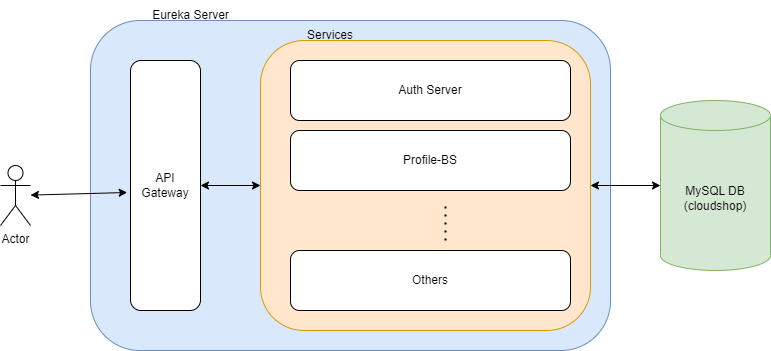

# CLOUD-SHOP
Architecture:

The modules in this project are listed below:

### Pre-requisites:
1. You need to configure following variables in your Environment Variables:
   1. **SQL_DATASOURCE_USERNAME** - Username for your SQL db
   2. **SQL_DATASOURCE_PASSWORD** - Password for your SQL db

## 1. eureka-server
This is a service registry where all services will be registered.

## 2. api-gateway
This service will act as an api-gateway and handle the routing and authentication part.
 - **Routing**: All services can be called from the port on which api-gateway is running. No need to keep track of ports of individual services. This is achieved using the configuration in the application.properties file. 
 - **Authentication**: Once the user is registered and has the appropriate token, this service intercepts each call towards other services and makes sure that the user has provided a valid token with intended roles. If user doesn't have such token, access will be denied.

## 3. auth-server
This service is responsible for loading the user in db and generating jwt tokens for the users already registered.
- **Sign-Up**: Here, a new user is created provided that the email id and username is unique. While registering user can provide the roles for thier profile such as "admin", "mod", "user".
- **Login**: Here, registered users can generate a jwt token based one their credentials and the roles provided at the time of registration. 

## 4. profile-bs
This is a business service where users can create, update, read, delete their profiles.

## 5. exception-handler
This is a global exception handler. All the exceptions thrown anywhere in the application can be caught here and converted into a meaningful json with custom messages and status codes.

